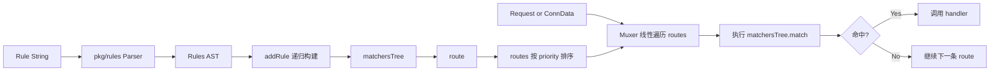
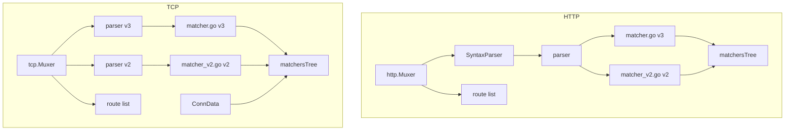
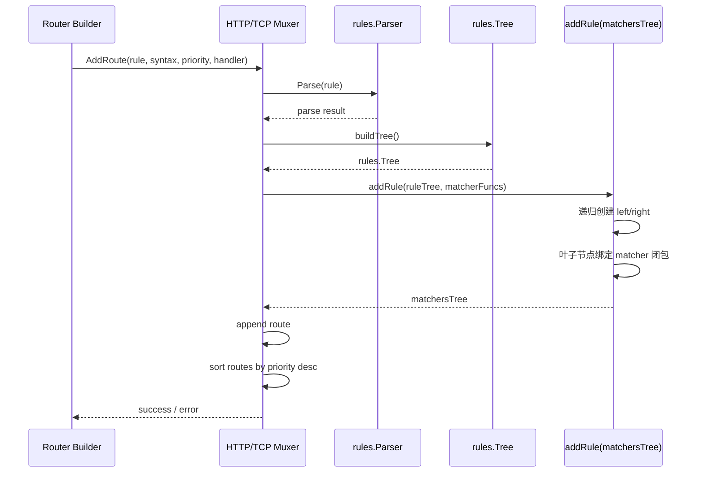
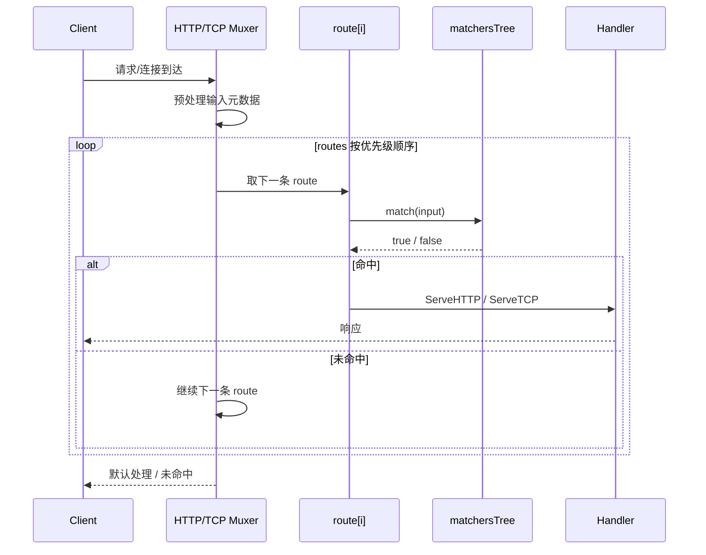

# pkg/muxer HTTP/TCP Match Tree 详细设计说明

## 1. 文档目的

本文档说明 `pkg/muxer/` 下 HTTP 与 TCP 多路复用中 match tree 的详细设计，覆盖以下内容：

- 整体架构与执行流程
- 规则解析、match tree 构建、运行时匹配机制
- HTTP 与 TCP 子模块的详细设计
- v2/v3 语法差异、优先级、特殊规则与扩展点
- 当前实现的复杂度、约束与演进建议

本文档描述的对象主要对应以下代码：

- `pkg/muxer/http/mux.go`
- `pkg/muxer/http/parser.go`
- `pkg/muxer/http/matcher.go`
- `pkg/muxer/http/matcher_v2.go`
- `pkg/muxer/tcp/mux.go`
- `pkg/muxer/tcp/matcher.go`
- `pkg/muxer/tcp/matcher_v2.go`

## 2. 设计范围与非目标

### 2.1 设计范围

本设计聚焦于“规则如何被解析成 match tree，并在请求/连接到达时用于路由匹配”。

覆盖：

- 路由规则的解析与校验
- 规则 AST 到可执行 match tree 的转换
- 请求/连接元数据的抽取
- 路由优先级排序与线性匹配
- 叶子 matcher 的职责边界

不覆盖：

- 具体业务 handler 的处理逻辑
- TLS 握手本身的实现细节
- 配置中心、Provider、动态配置热更新流程

### 2.2 非目标

当前实现的 match tree 不是“基于前缀/哈希/Trie 的索引树”，而是“布尔表达式执行树”。

因此本文明确不将其定义为：

- Host 前缀索引树
- Path Trie
- 多维条件检索引擎

运行时的主流程仍然是：

1. 路由列表按优先级排序
2. 逐条 route 执行 match tree
3. 命中第一条后立即返回

## 3. 术语定义

### 3.1 Rule

用户配置的路由规则字符串，例如：

- HTTP: `Host(\`example.com\`) && PathPrefix(\`/api\`)`
- TCP: `HostSNI(\`example.com\`) && ALPN(\`h2\`)`

### 3.2 Rules AST

通过 `pkg/rules` 解析得到的语法树，节点类型包含：

- 逻辑操作节点：`and`、`or`
- 叶子 matcher 节点：如 `Host`、`PathPrefix`、`HostSNI`
- 取反标记：`Not`

### 3.3 Match Tree

`matchersTree` 是运行时可执行树。它不是语法树的直接复刻，而是将每个叶子节点编译为一个闭包 matcher 后得到的执行树。

节点结构只保留两类信息：

- 叶子：`matcher func(...) bool`
- 非叶子：`operator + left + right`

### 3.4 Route

一条可参与匹配的路由单元，包含：

- `matchers matchersTree`
- `handler`
- `priority`
- TCP 场景下额外包含 `catchAll`

## 4. 整体设计

### 4.1 总体思路

HTTP 与 TCP muxer 采用相同的两阶段设计：

1. 构建期：把规则字符串解析并编译为 match tree
2. 运行期：把请求/连接映射为输入对象，执行 match tree，命中后分发 handler

这种设计的核心价值：

- 将解析成本前移到路由注册阶段
- 运行期只做布尔求值，不再重复解析规则
- 通过闭包固化 matcher 参数，减少运行时分支
- 用统一树结构表达复杂逻辑组合

### 4.2 共性架构图



### 4.3 模块设计图



### 4.4 构建期时序图



### 4.5 运行期时序图



## 5. 核心数据结构设计

### 5.1 `matchersTree`

HTTP 与 TCP 的 `matchersTree` 结构完全同构，区别仅在叶子函数签名：

- HTTP: `MatcherFunc func(*http.Request) bool`
- TCP: `func(ConnData) bool`

结构语义如下：

```text
type matchersTree struct {
    matcher  // 叶子闭包
    operator // and / or
    left
    right
}
```

约束：

- `matcher != nil` 时，节点必须是叶子节点
- `operator != ""` 时，节点必须是内部节点
- `left/right` 只在逻辑节点有效

### 5.2 `route`

`route` 是 match tree 的宿主：

- `matchers`：规则编译后的执行树
- `handler`：命中后的处理器
- `priority`：冲突裁决顺序
- `catchAll`：仅 TCP 使用，用于标识 `HostSNI("*")`

### 5.3 `routes`

`routes` 是 `[]*route`，通过 `sort.Interface` 按 `priority` 倒序排序。

因此运行期行为是：

- 优先匹配高优先级规则
- 相同复杂度下不引入额外索引层
- 插入新路由后立即重新排序

## 6. Match Tree 构建设计

### 6.1 构建入口

HTTP 与 TCP 的入口分别为：

- HTTP: `Muxer.AddRoute`
- TCP: `Muxer.AddRoute`

两者都遵循如下流程：

1. 选择语法版本对应的 parser
2. 调用 `Parse(rule)` 得到解析结果
3. 将解析结果转换为 `rules.Tree`
4. 调用 `matchersTree.addRule(...)`
5. 将生成的树挂载到 route

### 6.2 `addRule` 递归策略

`addRule` 的职责是把 `rules.Tree` 编译成 `matchersTree`。

处理分两类：

#### 6.2.1 逻辑节点

当 `rule.Matcher` 为 `and` 或 `or` 时：

- 当前节点记录 `operator`
- 分配 `left`、`right`
- 递归构建左右子树

这样保留了原始逻辑组合关系。

#### 6.2.2 叶子节点

当 `rule.Matcher` 为具体 matcher 时：

1. 用 `rules.CheckRule(rule)` 做合法性检查
2. 根据 matcher 名称从 `matcherFuncs` 查找 builder
3. 调用 builder，把参数编译为闭包 `matcher`
4. 若 `rule.Not == true`，再包一层取反闭包

其中第 4 步很关键：当前实现并不为 `not` 单独创建树节点，而是在叶子上包装函数。

### 6.3 `not` 的设计

`not` 的落点是叶子 matcher，而不是逻辑运算节点。

实现方式：

1. 先创建原始 matcher
2. 保存原 matcher 引用
3. 用新闭包 `return !matcherFunc(...)` 覆盖原 matcher

优点：

- 树结构简单
- 不需要额外定义一元操作节点
- 运行期开销仅多一次布尔取反

限制：

- `not` 的语义由语法树预先约束
- 文档与测试必须清晰说明 `not` 的作用域绑定到哪个 matcher/子表达式

## 7. 运行期求值设计

### 7.1 求值入口

- HTTP: `matchersTree.match(req *http.Request) bool`
- TCP: `matchersTree.match(meta ConnData) bool`

### 7.2 求值规则

1. 若节点为空，记录 warning 并返回 `false`
2. 若是叶子节点，直接执行 `matcher(...)`
3. 若是逻辑节点，按 `operator` 执行短路求值

短路语义：

- `or`: 左侧为 `true` 时不再计算右侧
- `and`: 左侧为 `false` 时不再计算右侧

这保证：

- 与布尔表达式直觉一致
- 避免不必要的 matcher 计算
- 避免某些昂贵 matcher 在短路场景下被执行

### 7.3 路由层求值

match tree 只解决“一条 route 是否命中”。

真正的多路复用由 Muxer 完成：

1. 遍历已排序 `routes`
2. 调用 `route.matchers.match(...)`
3. 第一条命中即终止遍历

因此系统的整体行为不是“全量求最优”，而是“按优先级做 first-match wins”。

## 8. HTTP Match Tree 详细设计

### 8.1 HTTP 模块组成

HTTP 子模块由以下部件组成：

- `Muxer`：路由注册与请求分发
- `SyntaxParser`：管理 v2/v3 parser
- `parser`：调用 `pkg/rules` 完成语法解析
- `httpFuncs`：v3 matcher builder 集合
- `httpFuncsV2`：v2 matcher builder 集合
- `matchersTree`：运行期执行树

### 8.2 HTTP 构建流程

HTTP 构建阶段由 `SyntaxParser` 统一封装：

- `NewSyntaxParser` 初始化 `v2`、`v3` 两套 matcher builder
- `parse(syntax, rule)` 根据 `syntax` 选用对应 parser
- 未知 syntax 自动回退到 `v3`

这意味着 HTTP 设计在扩展语法版本时更清晰，parser 生命周期也更集中。

### 8.3 HTTP 运行时输入预处理

HTTP 在执行 match tree 之前，会先调用 `withRoutingPath(req)`。

其作用不是普通 URL 清洗，而是生成“路由用 path”：

- 对 `EscapedPath` 逐字符扫描
- 保留 RFC3986 中的保留字符的百分号编码形式
- 仅解码非保留字符
- 将结果写入 `mux.RoutingPathKey` 对应的 context

这样做的原因：

- 提升规则书写体验，例如允许 `PathPrefix("/foo bar")` 匹配 `/foo%20bar`
- 同时避免解码保留字符后改变 URL 语义

受影响的 matcher：

- `Path`
- `PathPrefix`
- `PathRegexp`
- 以及 v2 中基于 `gorilla/mux` 的 path 类 matcher

### 8.4 HTTP 叶子 matcher 设计

#### 8.4.1 v3 matcher 集合

`httpFuncs` 包含：

- `ClientIP`
- `Method`
- `Host`
- `HostRegexp`
- `Path`
- `PathRegexp`
- `PathPrefix`
- `Header`
- `HeaderRegexp`
- `Query`
- `QueryRegexp`

设计特点：

- 大多数 matcher 直接编译为闭包
- 参数个数通过 `expectNParameters` 统一校验
- 正则类 matcher 在构建期完成编译，避免运行期重复编译

#### 8.4.2 Host 类 matcher

`Host` / `HostRegexp` 依赖 `requestdecorator` 写入上下文的规范化 host：

- `GetCanonizedHost`
- `GetCNAMEFlatten`

匹配特性：

- 仅允许 ASCII
- 构建期转小写
- 兼容尾部 `.` 的 FQDN 场景
- 支持 CNAME flatten 后的 host 对比

#### 8.4.3 Path 类 matcher

`Path` / `PathPrefix` 要求参数必须以 `/` 开头。

运行时不直接依赖 `req.URL.Path`，而是依赖 `getRoutingPath(req)`，这是 HTTP 路由匹配语义稳定的关键。

#### 8.4.4 Header / Query 类 matcher

设计原则：

- 精确匹配使用字符串比较
- 模糊匹配使用预编译正则
- Query 支持只校验 key 存在，也支持校验 key-value

### 8.5 HTTP v2 matcher 设计

`httpFuncsV2` 主要用于兼容旧语法语义，设计上大量复用 `gorilla/mux`：

- `PathV2` / `PathPrefixV2`：通过 `mux.Route` 完成路径匹配
- `methodsV2`、`headersV2`、`headersRegexpV2`、`queryV2`：直接复用 `mux.Route.Match`
- `hostRegexpV2`：复用 `mux.Router().Host(...)`

这样做的原因：

- 尽量保持与 v2 历史行为一致
- 降低重新实现旧语义的偏差风险

代价：

- v2/v3 行为并不完全一致
- 部分旧行为无法 100% 迁移，例如测试中已说明某些 v2 `Method` 相关语义无法完全复现

### 8.6 HTTP 路由分发设计

`ServeHTTP` 流程如下：

1. 获取 logger
2. 预处理 routing path
3. 按优先级遍历所有 route
4. 第一条命中则调用其 handler
5. 若无命中，走 `defaultHandler`

默认 handler 为 `http.NotFoundHandler()`。

这表示 HTTP muxer 的匹配失败语义是显式的 404。

### 8.7 HTTP 扩展点

HTTP 提供了显式扩展点 `WithMatcher`：

- 可向指定 syntax 注册新的 matcher 名称
- 外部仅需提供 `builderFunc(params ...string) (MatcherFunc, error)`
- 注册时会被包装成内部 `matcherBuilderFunc`

这使 HTTP match tree 可以在不改动核心求值逻辑的前提下扩展新的叶子 matcher。

## 9. TCP Match Tree 详细设计

### 9.1 TCP 模块组成

TCP 子模块由以下部件组成：

- `Muxer`：路由注册与连接分发
- 两套 parser：`parser` 与 `parserV2`
- `ConnData`：连接元数据载体
- `tcpFuncs`：v3 matcher builder 集合
- `tcpFuncsV2`：v2 matcher builder 集合
- `matchersTree`：运行期执行树

与 HTTP 相比，TCP 没有单独的 `SyntaxParser` 封装，语法分流逻辑直接写在 `Muxer.AddRoute` 中。

### 9.2 `ConnData` 设计

`ConnData` 是 TCP match tree 的唯一输入载体，字段包括：

- `serverName`
- `remoteIP`
- `alpnProtos`
- `host`
- `port`

来源：

- `serverName`：TLS SNI
- `remoteIP`：连接对端地址
- `alpnProtos`：TLS ALPN 协商结果
- `host` / `port`：本地监听地址

设计意义：

- 将运行时依赖统一收敛成值对象
- 让 matcher 不直接依赖底层连接对象
- 便于测试通过 `FakeConnData` 构造输入

### 9.3 TCP 构建流程

TCP `AddRoute` 会根据 `syntax` 选择：

- `v2` -> `parserV2 + tcpFuncsV2`
- 默认 -> `parser + tcpFuncs`

随后执行：

1. 解析规则
2. 转为 `rules.Tree`
3. 构建 `matchersTree`
4. 判断是否为 `catchAll`
5. 追加路由并排序

### 9.4 TCP 叶子 matcher 设计

#### 9.4.1 v3 matcher 集合

`tcpFuncs` 包含：

- `ALPN`
- `ClientIP`
- `HostSNI`
- `HostSNIRegexp`
- `PortRegexp`

其中 `PortRegexp` 实际上不是正则，而是端口区间表达式解析器，支持：

- `start-end`
- `start/end`
- `start:end`

构建期将其转成端口范围数组，运行期做区间判断。

#### 9.4.2 ALPN matcher

无论 v2 还是 v3，均禁止 `tlsalpn01.ACMETLS1Protocol`，避免与 ACME TLS-ALPN-01 场景冲突。

#### 9.4.3 HostSNI matcher

`HostSNI` 是 TCP 路由中最关键的叶子之一，特点如下：

- 使用 ASCII/host 格式校验
- 构建期统一转小写
- 兼容尾部 `.` 的 FQDN 写法
- 特殊值 `*` 被视为全局通配

### 9.5 TCP catch-all 设计

TCP 有一个 HTTP 没有的特殊语义：`HostSNI("*")`。

它既是普通 matcher，又被识别为 catch-all 路由：

- `GetRulePriority` 对该规则返回 `-1`
- `route.catchAll = true`
- `Match` 返回 `(handler, catchAll)`

设计目的：

- 使其作为无 SNI 或兜底路由时，天然排在最低优先级
- 上层调用方可感知“这是兜底匹配，而不是精确命中”

注意：

- 只有规则树完全等于 `HostSNI("*")` 时才会被视为 catch-all
- `HostSNIRegexp("^.*$")` 不属于 catch-all
- 复合表达式中包含 `HostSNI("*")` 也不自动成为 catch-all

### 9.6 TCP v2 matcher 设计

`tcpFuncsV2` 包含：

- `ALPN`
- `ClientIP`
- `HostSNI`
- `HostSNIRegexp`

与 v3 相比：

- 支持多个参数的语义更多
- `HostSNIRegexp` 支持类似 gorilla/mux 模板的模式展开
- 不包含 `PortRegexp`

`hostSNIRegexpV2` 的实现并非直接把输入当普通 regexp，而是先通过 `preparePattern` 构造最终模式：

- 解析花括号变量
- 为变量补默认 pattern
- 自动加大小写不敏感前缀 `(?i)`
- 首尾锚定为完整匹配

这套实现本质上是在兼容 v2 的模板式 host 匹配行为。

### 9.7 TCP 路由分发设计

`Muxer.Match(meta ConnData)` 的职责是：

1. 顺序扫描 route
2. 找到第一条命中的 route
3. 返回对应 handler 与 `catchAll` 标记

若无命中，返回：

- `nil`
- `false`

与 HTTP 不同，TCP muxer 本身不持有 default handler，这个差异与两种协议的接入方式一致。

## 10. 优先级与路由选择设计

### 10.1 默认优先级

HTTP 与 TCP 的默认策略都基于规则字符串长度：

- 规则越长，优先级越高

直觉上，规则越长通常约束越多，也更具体。

### 10.2 TCP 特例

TCP 对 `HostSNI("*")` 做了特判：

- 默认优先级固定为 `-1`

这保证兜底路由总在最后被评估。

### 10.3 路由选择算法

排序规则：

- `priority` 降序

命中规则：

- 第一条命中的 route 生效

这一定义了非常明确的冲突裁决模型：

- 不是“最精确命中”
- 不是“全量打分”
- 而是“显式优先级 + first match wins”

## 11. 错误处理设计

### 11.1 构建期错误

构建期错误会直接阻止 route 注册，典型场景包括：

- 规则语法错误
- matcher 名称不存在
- 参数个数不正确
- 正则编译失败
- Host/Path 参数不合法
- 端口范围配置非法

设计原则：

- 尽量在注册阶段失败
- 避免将非法配置拖到运行期

### 11.2 运行期错误

运行期大多数 matcher 不返回 error，而是：

- 记录 warning/debug 日志
- 返回 `false`

这样做的原因：

- 匹配过程应尽量保持纯布尔求值接口
- 避免单个 matcher 抛错干扰整个路由器主流程

HTTP `withRoutingPath` 是少数例外：

- 若 path 百分号编码异常，则直接返回 `400 Bad Request`

## 12. 复杂度与性能分析

### 12.1 构建期复杂度

对于单条规则：

- 解析复杂度与规则长度线性相关
- `addRule` 复杂度与 AST 节点数线性相关

### 12.2 运行期复杂度

设：

- `R` = route 数量
- `T` = 单条 route 的 match tree 节点数

则最坏情况下：

- HTTP/TCP 匹配复杂度约为 `O(R * T)`

但实际通常优于最坏情况，因为：

- route 按优先级排序，常见请求会较早命中
- `and/or` 使用短路求值
- 叶子正则在构建期已完成编译

### 12.3 当前实现的优势

- 实现简单，易验证
- 与规则语法天然一致
- 兼容复杂布尔表达式
- 易于测试和增量扩展 matcher

### 12.4 当前实现的限制

- route 数量大时缺少索引加速
- 大量正则 matcher 会抬高单次求值成本
- 深层嵌套表达式会带来递归调用开销
- HTTP/TCP 的 parser 组织方式不完全统一

## 13. 可维护性与扩展设计

### 13.1 新增 matcher 的方法

HTTP:

- v3：向 `httpFuncs` 添加 builder
- v2：向 `httpFuncsV2` 添加 builder
- 或通过 `WithMatcher` 动态注册

TCP:

- v3：向 `tcpFuncs` 添加 builder
- v2：向 `tcpFuncsV2` 添加 builder

新增 matcher 时应满足：

- 参数校验尽量前置
- 昂贵初始化逻辑在构建期完成
- 运行期闭包保持无副作用、仅返回布尔值

### 13.2 演进建议

后续若 route 数量持续增长，可以考虑以下方向：

1. 在 route 列表之前增加粗粒度索引层，例如按 Host/HostSNI 分桶
2. 对 PathPrefix 等高频 matcher 建立前置候选集
3. 统一 HTTP/TCP 的 parser 管理模型
4. 将 match tree 可视化能力做成调试工具

但这些演进不应破坏当前两个关键语义：

- 规则布尔语义与 `pkg/rules` 保持一致
- 路由冲突裁决仍然可解释

## 14. 关键设计结论

### 14.1 结论一

`pkg/muxer` 的 match tree 本质是“规则编译后的布尔执行树”，不是检索索引树。

### 14.2 结论二

HTTP 与 TCP 采用统一抽象：

- 规则解析为 AST
- AST 编译为 `matchersTree`
- 按优先级线性扫描 route
- 命中第一条后立即分发

### 14.3 结论三

HTTP 的重点在于：

- `routingPath` 预处理
- v2/v3 语义兼容
- host/path/header/query 多维 matcher

TCP 的重点在于：

- `ConnData` 元数据抽象
- `HostSNI("*")` catch-all 特例
- ALPN/SNI/IP 等连接级 matcher

### 14.4 结论四

当前设计优先保证：

- 规则语义正确性
- 实现可维护性
- 兼容旧版本行为

而不是优先追求超大规模路由表下的极致匹配性能。

## 15. 附录：HTTP/TCP 共性与差异对照

| 维度 | HTTP | TCP |
| --- | --- | --- |
| 运行时输入 | `*http.Request` | `ConnData` |
| 默认处理 | `http.NotFoundHandler()` | 无内建 default handler |
| 语法选择 | `SyntaxParser` | `Muxer.AddRoute` 内部分流 |
| match tree 结构 | `matcher/operator/left/right` | `matcher/operator/left/right` |
| 短路求值 | 支持 | 支持 |
| `not` 实现 | 叶子闭包包裹取反 | 叶子闭包包裹取反 |
| v2 兼容策略 | 大量复用 `gorilla/mux` | 自定义兼容实现 |
| 特殊规则 | routing path 预处理 | `HostSNI("*")` catch-all |
| 默认优先级 | 规则长度 | 规则长度，catch-all 为 `-1` |

